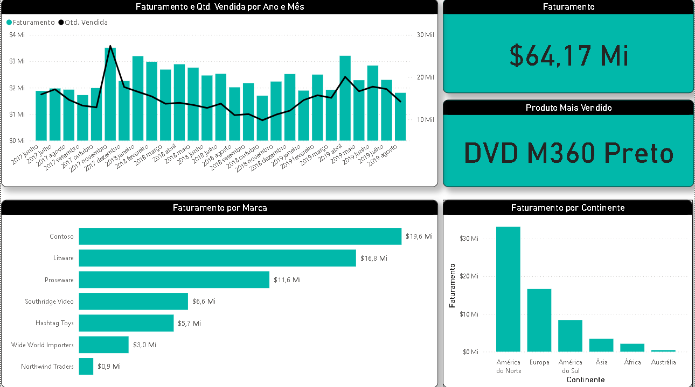

# 📊 Dashboard de Análise de Vendas (Performance Comercial)

## 📋 Contexto do Projeto
Este dashboard foi desenvolvido para analisar o desempenho de vendas de uma empresa de varejo/tecnologia que opera globalmente. O objetivo principal é fornecer insights acionáveis sobre faturamento, lucratividade, desempenho de produtos e distribuição geográfica das vendas.

A base de dados conta com mais de **200.000 registros**, abrangendo o período de 2017 a 2019, o que exigiu um tratamento de dados robusto e medidas DAX otimizadas.

---

## 📸 Demonstração

*Legenda: Navegação pelos filtros de categoria e análise de evolução temporal.*

---

## 🛠️ Funcionalidades e KPIs
O dashboard foca nos seguintes indicadores chave de performance (KPIs):

1.  **Análise de Receita e Lucro:** Cálculo dinâmico de Faturamento Total, Custo Total e Margem de Lucro.
2.  **Visão de Produto:** Ranking de categorias mais vendidas (Ex: Sistema de Som, Games, Laptops) e marcas (Litware, Contoso, etc).
3.  **Análise Geográfica:** Mapa de vendas por localidade (Europa, América do Norte, América do Sul, Ásia).
4.  **Sazonalidade:** Gráfico de linha para identificar picos de venda ao longo dos meses e anos.
5.  **Segmentação:** Filtros avançados por Marca, Categoria e Data para exploração profunda dos dados.

---

## 🧮 Tecnologias Utilizadas
* **Power BI:** Construção dos visuais e dashboards.
* **Power Query (M):** Limpeza de dados, tratamento de nulos e formatação de colunas de data e localidade.
* **DAX:** Criação de medidas para cálculo de margem, crescimento (YoY) e acumulados.
* **Excel/CSV:** Fonte de dados bruta.

---

## 📂 Estrutura do Repositório
* `dash_vendas.pbix`: Arquivo do Power BI com o dashboard final.
* `Vendas.xlsx`: Base de dados utilizada no projeto.
* `/assets`: Imagens e GIFs utilizados neste README.

---

## 🚀 Como Visualizar
1.  Faça o download do arquivo `dash_vendas.pbix` presente neste repositório.
2.  Certifique-se de ter o **Power BI Desktop** instalado em sua máquina.
3.  Abra o arquivo para interagir com os filtros e visuais.

---

## ✍️ Autor
**Fernando Tinno Venceslau**
* * [LinkedIn](https://www.linkedin.com/in/fernando-tinno/)

---